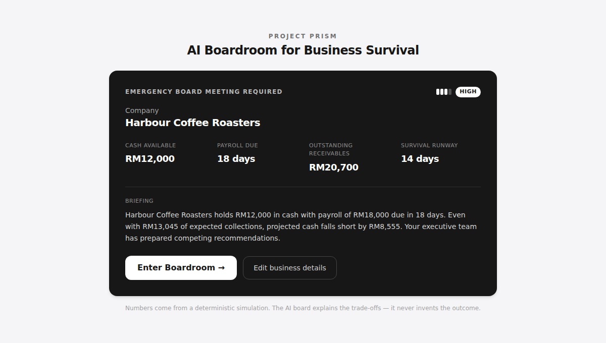
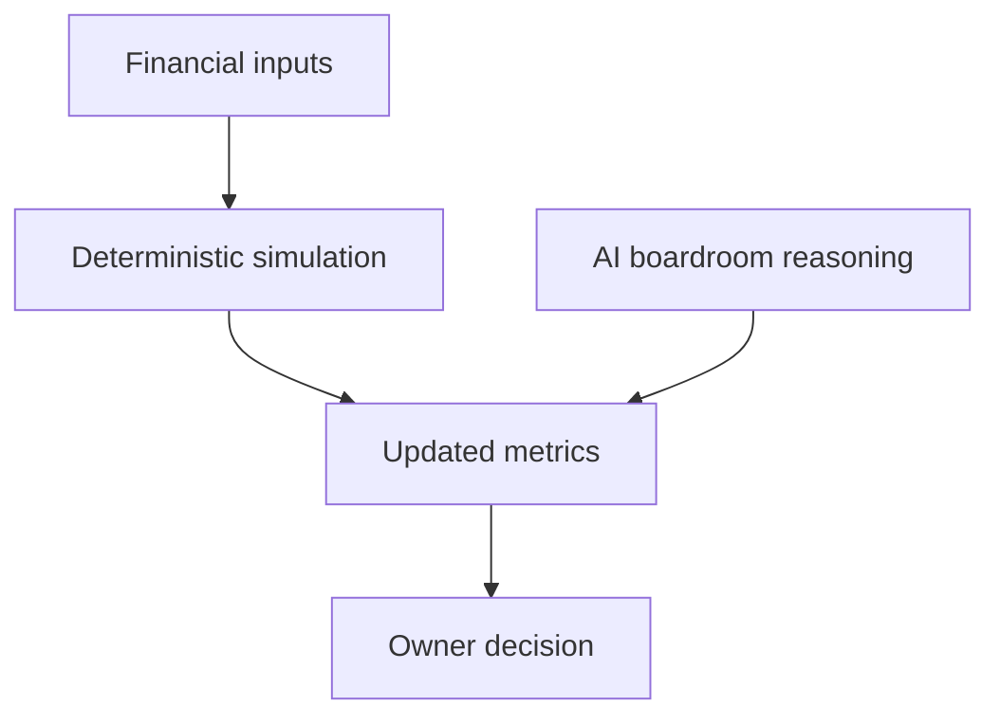

# Project Prism

**AI Boardroom for SME financial decisions.**

Accounting software records history. Project Prism lets owners rehearse
decisions before making them: two AI executives argue the trade-off, then a
deterministic simulation shows what the owner's choice does to cash, runway,
and payroll risk.

**The math is deterministic. The debate is AI. The decision is yours.**

> Built for the AMD Developer Hackathon ACT II — Track 3 (Unicorn Track).
> Boardroom inference runs on [Fireworks AI](https://fireworks.ai)
> using the configured Fireworks model.



---

## Architecture — deterministic core, AI on top

The most important design decision: **the AI never calculates a number.** Every
figure comes from plain, testable TypeScript. The board only *explains* the
trade-offs. If the AI is unavailable, the app falls back to a static board and
the numbers are identical — the demo cannot break.

```
                 ┌─────────────────────────────────────────────┐
                 │            checkFinancialHealth()            │  ← deterministic
   business ───▶ │   cash · runway · payroll gap · risk level   │     (frozen,
   inputs        └───────────────────┬─────────────────────────┘      testable)
                                     │
                      ┌──────────────┴───────────────┐
                      ▼                               ▼
            ┌───────────────────┐          ┌────────────────────────┐
            │  AI boardroom      │          │  simulateDecision()    │  ← deterministic
            │  (Fireworks AI)    │          │  each option's outcome │
            │  explains only     │          │  cash / runway / risk  │
            │  ⤷ static fallback │          └───────────┬────────────┘
            └───────────────────┘                      │
                      │                                 ▼
                      └──────────▶  UI: compare options, pick, see impact
```

**Why this matters for judges:** the AI is *enhancement, not dependency*. Pull
the API key and the product still works, still shows correct numbers, still
tells the story. That is the opposite of most "AI" demos.

---

## The problem

Small businesses often do not fail because revenue disappears. They fail
because owners see the cash crunch too late and choose without understanding
the effect on payroll, runway, and overdue invoices.

## The demo

```
Payroll alert
    ↓
AI boardroom
    ↓
Owner decision
    ↓
Simulation engine
    ↓
Updated cash position
```

The demo opens on an **emergency briefing** — a crisis snapshot (cash, payroll
countdown, projected shortfall, runway, risk level) with one CTA: *Enter
Boardroom*. Inside, two named executives weigh in: **Maya Chen (CFO)** argues
for preserving cash; **Daniel Reyes (Collections Manager)** disagrees and pushes
receivables recovery. A **Compare all options** table shows every action's
payroll outcome, cash, and runway with the best one badged *Recommended*. The
owner chooses, and the simulation updates the numbers — and the risk level —
instantly.

Payroll is today's scenario. The platform pattern can extend to pricing,
hiring, expansion, funding, and other high-stakes SME decisions.

## Why AI

The AI does not calculate the outcome. It explains the trade-off.

Why AI? Because different stakeholders optimize different objectives, and AI
lets them reason from those perspectives while the deterministic engine
guarantees consistent outcomes.

The deterministic engine owns the math:



That split is the product's credibility: useful boardroom reasoning without
letting the model invent financial numbers.

---

## How a session runs

```
Risk detected → agents respond → owner chooses → simulation updates
```

1. A sample company (**Harbour Coffee Roasters**) is loaded — or the owner
   enters their own numbers.
2. `checkFinancialHealth()` detects a payroll cash crunch.
3. The boardroom convenes: two AI executives (**CFO**, then **Collections
   Manager**) reason **sequentially** over the same numbers — the second
   reads the first's argument and pushes back.
4. The owner clicks a decision.
5. `simulateDecision()` deterministically updates the metrics and chart.

---

## The AI boardroom

Clicking **Convene the Boardroom** streams a live, two-step analysis:

- **Step 1 — CFO** evaluates the deterministic financial numbers and returns a
  headline, recommendation, three bullets, primary risk, and payroll coverage score.
- **Step 2 — Collections Manager** receives the CFO's *literal* output, reads
  its stance, and responds from the receivables angle.

Both inferences run **server-side** in `/api/boardroom` via
[Fireworks AI](https://fireworks.ai) (`accounts/fireworks/models/minimax-m3`
by default). The route
streams NDJSON events so the UI shows a live "Step 1 → Step 2" indicator.

**The AI never invents numbers.** Every figure comes from the deterministic
engine; the agents only produce natural-language reasoning. Their JSON is
schema-validated server-side.

**Payroll coverage score is deterministic.** The displayed score reflects
whether that agent's recommended response protects payroll in the simulation.

**No key? It still works.** If `FIREWORKS_API_KEY` is missing, the API errors,
or a response fails to decode, the route automatically falls back to the static
mock boardroom in `lib/agents.ts`. A badge under the cards shows whether the
result came from **Fireworks AI** or the **offline fallback**.

---

## The AMD compute layer

The deterministic engine gives each option one *expected* outcome. A separate
GPU layer adds the **risk distribution around** that expected case — computed on
an **AMD Instinct GPU** via **ROCm + PyTorch** in
[`notebooks/amd_scenario_analysis.ipynb`](notebooks/amd_scenario_analysis.ipynb):

1. **Monte Carlo** — 50,000 simulated futures per decision, varying invoice
   collections and operating burn, → the probability payroll actually survives.
2. **Predictive model** — a small classifier trained on the GPU that confirms
   the deterministic risk ranking (methodology only; no model number is shown as
   fact).
3. **Synthetic cohort** — a generated peer group for benchmark context.

**It never overrides the engine.** The Monte Carlo is *mean-preserving*: the
average of the 50k paths reconciles with `checkFinancialHealth()`. The panel is
additive — it shows how much residual risk remains around the deterministic
number. In the sample scenario it reveals something the point-estimate hides:
settling the largest invoice early (*Prioritize Client Alpha*) scores a smaller
expected gap but a **lower** survival probability, because it trades away the
upside variance of that invoice.

The committed data in `public/data/*.json` is a snapshot; each file stamps the
`device` it was produced on. Run the notebook on an AMD AI Notebook to
regenerate it on the GPU (a CPU reference, `notebooks/generate_snapshot.py`,
produces an identical-shaped snapshot for local dev). The in-app panel labels
itself *"AMD Instinct GPU"* or *"AMD pipeline (CPU snapshot)"* accordingly, and
hides itself whenever the owner edits the numbers (the snapshot no longer
applies).

## Tech stack

- [Next.js 14](https://nextjs.org/) (App Router, streaming route handler)
- React + TypeScript
- Tailwind CSS
- [Recharts](https://recharts.org/) for the cash projection chart
- [Fireworks AI](https://fireworks.ai) for the boardroom agents
- **AMD Instinct GPU (ROCm + PyTorch)** for the Monte Carlo scenario layer

## Getting started

```bash
npm install
npm run dev
```

Then open [http://localhost:3000](http://localhost:3000).

The app runs **with no setup** — the boardroom uses the offline
fallback. To enable live AI, add a Fireworks key:

```bash
cp .env.example .env.local
# then edit .env.local and set FIREWORKS_API_KEY=fw_...
```

Restart `npm run dev` after changing env vars.

---

## Project structure

```
project-prism/
├── app/
│   ├── api/
│   │   └── boardroom/
│   │       └── route.ts    # Sequential CFO → Collections boardroom stream
│   ├── layout.tsx          # Root layout + metadata
│   ├── page.tsx            # Dashboard: wires everything together
│   └── globals.css         # Tailwind + background styling
├── components/
│   ├── EmergencyBriefing.tsx    # Landing: crisis snapshot + Enter Boardroom CTA
│   ├── CompanyOnboardingForm.tsx# Owner enters their own business numbers
│   ├── MetricCard.tsx           # Dashboard metric card (with before/after)
│   ├── AgentCard.tsx            # Executive card: recommendation, bullets, risk
│   ├── ExecutiveActionPlan.tsx   # Post-decision action brief
│   ├── RiskBadge.tsx            # Four-segment risk meter
│   ├── BoardroomStatus.tsx      # Compact sequential step indicator
│   ├── OrchestrationConsole.tsx # Live boardroom thinking trace
│   ├── OptionComparison.tsx     # All options side by side; click to commit
│   ├── CountUp.tsx              # Animated cash counter (reduced-motion aware)
│   └── CashFlowChart.tsx        # Projected cash chart (Recharts)
├── lib/
│   ├── financialState.ts   # Sample SME state + types
│   ├── healthCheck.ts      # checkFinancialHealth() — deterministic
│   ├── simulation.ts       # simulateDecision() — deterministic
│   ├── risk.ts             # Risk level derivation (Low → Critical)
│   ├── executives.ts       # Named executives: Maya Chen (CFO), Daniel Reyes
│   ├── agents.ts           # Static fallback boardroom (data + shared type)
│   ├── fireworks.ts        # Server-only Fireworks calls + schema enforcement
│   ├── boardroom.ts        # Shared streamed-event protocol + phase types
│   └── useBoardroom.ts     # Client hook: streams /api/boardroom
├── notebooks/
│   ├── amd_scenario_analysis.ipynb # GPU Monte Carlo + model + cohort (AMD/ROCm)
│   ├── scenario_core.py            # Shared math, mirrors the TS engine
│   └── generate_snapshot.py        # CPU reference that writes the same JSON
├── public/data/                    # Committed snapshot consumed by the app
│   ├── scenario_analysis.json      # Per-option payroll-survival distribution
│   ├── cohort.json                 # Synthetic peer group
│   └── model_card.json             # Predictive-model methodology card
├── MASTER_SPEC.md          # Full product spec
├── BUILD_PLAN.md           # Milestone plan
└── .env.example            # Fireworks env vars
```

## The financial logic

`checkFinancialHealth(state)` computes:

| Value                        | Formula                                                         |
| ---------------------------- | --------------------------------------------------------------- |
| Expected collections         | `sum(invoice.amount × collectionProbability)`                   |
| Operating burn to payroll    | `monthlyOpex ÷ 30 × payrollDueInDays`                           |
| Projected cash before payroll| `cashBalance + expectedCollections − operatingBurnToPayroll − equipmentPurchase` |
| Payroll gap                  | `payrollAmount − projectedCashBeforePayroll`                    |
| Payroll risk                 | `payrollGap > 0`                                                |
| Runway days                  | `cashBalance ÷ (monthlyOpex ÷ 30)`                             |

> Projected cash before payroll nets out `operatingBurnToPayroll` — the
> operating cash the business burns over the days until payroll — so the
> deterministic engine reflects the real cash crunch ahead of payday.

`simulateDecision(state, action)` supports four actions — *Prioritize Client
Alpha*, *Delay Equipment Purchase*, *Offer Early Payment Discount*, and *Do
Nothing* — and returns the updated state plus before/after health snapshots.

---

## Testing the boardroom locally

**Offline / fallback (no key needed):**

1. `npm run dev`, open http://localhost:3000.
2. Click **Convene the Boardroom**. Watch the Step 1 → Step 2 indicator, then
   two cards appear with a **"Offline fallback"** badge.

You can also hit the API directly:

```bash
curl -N -X POST http://localhost:3000/api/boardroom \
  -H "Content-Type: application/json" -d '{}'
```

You'll see the streamed NDJSON events (`step`, `agent`, `agent`, `done`) with
`"source":"fallback"`.

**Live AI (with a Fireworks key):**

1. `cp .env.example .env.local` and set `FIREWORKS_API_KEY=fw_...`.
2. Restart `npm run dev`, click **Convene the Boardroom**.
3. The badge now reads **"Generated live by Fireworks AI"**, and the second
   agent's reasoning explicitly references the CFO's stance.

If the key is invalid or the API is unreachable, the run still completes using
the fallback — the demo never breaks.

---

## What's next (not in this milestone)

- Parallel / multi-round agent debate beyond the two-step sequence
- Streaming token-level output into the cards
- The deterministic engine stays the source of truth for all numbers
